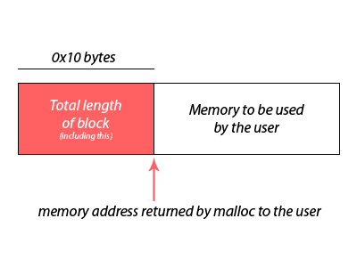

# **Learnings**

- ## **How to write your own malloc**

To be able to perform this, we need to know a few things... 
We need to know where the heap begins and the "break" (i.e program break) position, and of course we need to know how to move that break. 
This is the purpose of the two syscalls <a href='./Learnings.md#how-to-play-with-program-break-to-allocate-memory-dynamically'>**brk & sbrk**</a>

<quote> <i>By the end of this project, we should be able to answer all the following questions without the help of Google</i> </quote>

- ### **1. What is a program break**

The program break, also known as **brk** or **sbrk** value, is related of course to memory  
The program break represent the boundary, the frontier, between the data segment and the heap segment of a process's virtual memory space.
 
Of course, if for some reason, your program doesn't need a "heap" to work, the program break then marks the end of the **data segment**  
 
**Data segment** => section of memory which stores: global & static variables, and initialized data.  
**Heap segment** => region of memory used for dynamic memory allocation (malloc family), where the program can request and/or release memory as needed.
 
Any time we perform some malloc-kungfu-stuff, we **extend the program break**

That point of program break, acts as a marker, delimiter pointer that specifies the end of the heap. It indicates you the highest address in the process's virtual memory space that has been allocated for the heap.  
In other words, any address beyond that "marker" pointer, will shoot you back the famous "Segfault" if you try to access to it, it is considered unallocated or free.  

<strong> C language trick time => we can use the sbrk(0) syscall to retrieve the current program break value.</strong>

- ### **2. How to play with program break to allocate memory dynamically**

With C programming, in order to "play" with program break, we are provided two system calls **brk** and **sbrk**.  
Right from the <i>Fine Manual man brk/sbrk</i> we can read that they "change the location of the program break", two system calls for two different usages:

- **int brk(void \*addr)** sets the end of the data segment to the value specified by addr (if the value is reasonnable, don't try to push your program break to the Moon!)

- **void \*sbrk(intprt_t increment)** increment the program's data space by "increment"-bytes. Special trick => 
  Calling **srk(0)** can be used to find the **current location** of the program break.

- ### **3. How the glibc malloc & free functions work**

#### **malloc me**

**malloc** is a function as you know to dynamically allocate a block of memory with a specified size -> Returns a pointer to type 'void' which can be then typecasted to the user's needs. The man page states that the returned pointer is <i>suitably aligned for any built-in type</i>. 
But malloc is actually Lying to you!  

#### <i>malloc eats page(s)</i>

Malloc allocates size or "space" for you on the Heap. Sweet. A basic program using malloc that we strace with "strace" reveals that malloc (which is NOT a system call indeed you remember ?) is actually using the system call **brk** to manipulate the heap  
Remember **brk**, yeah it sets the program break to a specified address. Now, by increasing that program break, malloc creates a new "space" on the heap for your program to work dynamically.
 
If you try to look where your heap start & end (in the **/proc/[PID] filesystem** see repository Holbertonschool-system_linux/proc) , you'll notice that even if you ask only 1 byte, the size of the heap would have increased...much much more  

#### <i>What happened ??</i>

Actually, malloc needs a **system call** (to manipulate heap), and a system call is a pain => generally slower because of **privilege level, kernel involvment, context switching..** That"s why , malloc "trick" us and call **brk** once, but set the breakpoint "far-away" =>  
 
**How much far away is far away?** That far-away is not arbitrary...It has to do with the **memory alignement**
 
A closer look at the heap also reveals some "padding-bytes" before the block or pointer, that malloc returns us for working in the memory. The returned pointer to us is always **after** those "booked-bytes",which are kind of a "header" of metadata. a pictural representation of what's going on:

- ### **4. What is ASLR**

### **5. What is memory alignement**

Some "official docs" states =>  
<quote> memory alignement is the practice of arranging data in memory, in a way that it conducts to an efficient access by computer's processor. 
Memory alignement ensures that **data** is stored at memory addresses that are multiple of its size.
</quote> 
As described in [J'Barbier Blogpost](https://blog.holbertonschool.com/hack-the-virtual-memory-malloc-the-heap-the-program-break/) (did you read it ?? this is excellent 👍) , the first time we call malloc, it will increase the program break by a significant value - to avoid calling sbrk (system call) too many times. Allocating is made faster on further calls...  

#### **5§1 memory page**

The glibc malloc will always extend your program break by a multiple of the virtual **page-size**. On most of 64-bit architecture, the page size will be 4 kibiBytes , or (4 \* (2 to the power of 10)), You can determine your own page-size on your machine by using libcall **sysconf**.  
Grab the [page_size.c](./EYNTK/page_size.c) program and run it in your terminal 😉.

### **6. How to encapsulate the memory management in order to hide it from the user**

In our Implementations and exercises, we managed the memory allocation in order to abstract away to the user: the first famous **0x10 bytes** which are useless from user perspective, and also the fact that new program break extend really far away than let's say => a request for 512 bytes , the user never knows that actual program break has jumped to 4096 bytes (or a multiple of it, => 4096 <= memory page on many 64-bits systems)
The user doesn't know either about the **random brk offset** , there's always a "gap" between the end of data section of a program, and the actual "beginning" of its allocated heap-region. All of this is hidden to the user - and change at each call ! (see ASLR topic)  
Trick => when you compile and run on Linux, especially when you print addresses on your program, you notice that those addresses always changes (even without recompiling, just run run run and it changes at each call)  
If you want to "stick" to addresses - for fun haha - you can use the command  
`setarch x86_64 -R ./your_program`
